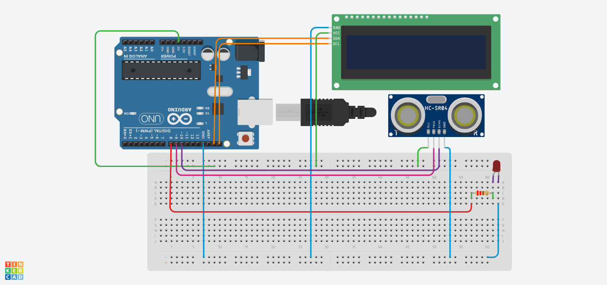

# Pyduino-Pc-Monitor
A tiny Arduino-powered desktop system monitor for Windows.

# 📊 Pyduino Pc Monitor

Turn an Arduino into a real-time desktop system monitor.

Pyduino Pc Monitor is a Python + Arduino project that displays live PC information on a 16x2 I2C LCD. It communicates through Serial and can show system statistics, Spotify playback, and alerts.


---

## ✨ Features

- 🖥️ CPU usage
- 🌡️ CPU temperature
- 💾 RAM usage
- 📀 Disk usage
- 🎵 Spotify integration
- 🔄 Automatic screen switching
- 🚨 LED temperature warning
- 🔌 Idle screen when the PC disconnects
- ⚡ Real-time Serial communication

---

## 📷 Preview

<p align="center">
  
  
</p>
<p align="center">
  
  
</p>
<p align="center">
  
</p>
---

## 🔧 Hardware

- Arduino Uno (or compatible)
- 16x2 I2C LCD
- LED
- 220Ω resistor
- Jumper wires
- USB cable

---

## 🔌 Wiring

| LCD | Arduino |
|------|----------|
| GND | GND |
| VCC | 5V |
| SDA | SDA |
| SCL | SCL |

LED

| LED | Arduino |
|-----|----------|
| Anode | D8 |
| Cathode | GND (220Ω resistor) |

A wiring diagram is available here:



---

## 📦 Installation

Clone the repository

```bash
git clone https://github.com/JVLEGEND0/Pyduino-Pc-Monitor.git
```

Install dependencies

```bash
pip install -r requirements.txt
```

Upload the Arduino sketch.

Configure your COM port inside `Pyduino_v0-9-1.py`.

---

## 🎵 Spotify Setup

1. Go to the Spotify Developer Dashboard.
2. Create a new App.
3. Copy the Client ID and Client Secret.
4. Paste them into the configuration section.

```python
CLIENT_ID = ""
CLIENT_SECRET = ""
REDIRECT_URI = ""
```

Authorize the application on the first launch.

---

## 🌡️ CPU Temperature

DeskStats uses **Libre Hardware Monitor** to read the CPU temperature in real time.

### Installation

1. Download **Libre Hardware Monitor**.
2. Extract it to any folder.
3. Launch `LibreHardwareMonitor.exe`.
4. Go to **Options → Remote Web Server** and enable it.
5. Leave Libre Hardware Monitor running while using Pyduino Pc Monitor.

> **Important**
>
> If Libre Hardware Monitor is not running or the Remote Web Server is disabled, the CPU temperature will not be available.

Download the latest version here:
https://github.com/LibreHardwareMonitor/LibreHardwareMonitor/releases
---

## 🚀 Future Plans

- ESP32 Wi-Fi support
- More sensors
- Better animations
- Clock CPU

---

Made by JV using Python and Arduino.

If you liked it, please consider starring the project. :D
